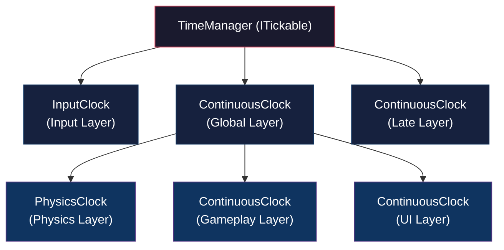

# TSI (Time, Scene, Input)

2D 액션 게임의 핵심 클라이언트 아키텍처를 구현하고 검증하는 포트폴리오 프로젝트입니다.

> Unity 6 (`6000.3.6f1`) · VContainer · MessagePipe · R3 · UniTask

---

## 주요 기능

### 1. Custom Time — 독립적 시간 관리

#### 왜 필요한가

Unity의 `Time.timeScale`은 전역에 하나만 존재합니다. 따라서 게임을 일시정지해도 UI 애니메이션은 계속 재생하거나, 특정 오브젝트만 슬로우모션을 적용하는 등의 **레이어별 독립적인 시간 제어**가 불가능합니다.

Custom Time 시스템은 Clock을 트리 구조로 구성하여, 각 레이어가 독립적인 `TimeScale`과 `Pause`를 가지도록 설계하였습니다. 부모 Clock의 시간 변화가 자식에게 전파되므로, 상위 레이어를 멈추면 하위 레이어도 자연스럽게 멈춥니다.

#### 아키텍처



- **`TimeManager`** — VContainer의 `ITickable`로 매 프레임 루트 Clock들을 구동합니다.
- **`ContinuousClock`** — 매 프레임 `deltaTime × TimeScale`을 계산하고, MessagePipe를 통해 `TickMessage`를 발행합니다.
- **`FixedClock`** — 고정 timestep 누적 방식으로 동작합니다. `FixedTimestep` 간격으로 tick을 발행하며, `MaxSteps`로 한 프레임 내 최대 스텝 수를 제한합니다.
- **`PhysicsClock`** — `FixedClock`을 확장하여 `Physics.Simulate()`를 수동 호출합니다. 스크립트에서 물리를 직접 시뮬레이션하면 Unity의 FixedUpdate 기반 Rigidbody 보간을 사용할 수 없으므로, 이전/현재 위치를 기록하고 렌더 트랜스폼에 직접 Lerp 보간을 적용합니다.
- **`InputClock`** — `InputSystem.Update()`와 `EventSystem.Update()`를 수동 호출하여 입력 처리 타이밍을 시간 계층 안에서 제어합니다.

#### Clock 계층 구성 예시

`ITimeHierarchyFactory`를 구현하여 Clock 트리를 자유롭게 구성할 수 있습니다.

```csharp
public class DefaultTimeHierarchyFactory : ITimeHierarchyFactory
{
    public TimeHierarchyResult Create()
    {
        var builder = new TimeHierarchyBuilder();

        // 루트 Clock 등록
        builder.RegisterRoot(new InputClock(_inputUpdater));
        builder.RegisterRoot(globalClock);
        builder.RegisterRoot(lateClock);

        // Global의 자식으로 등록 — Global이 멈추면 함께 멈춤
        builder.RegisterChild(globalClock, physicsClock);
        builder.RegisterChild(globalClock, gameClock);
        builder.RegisterChild(globalClock, uiClock);

        return builder.Build();
    }
}
```

#### Tick 구독 예시

특정 TimeLayer의 tick을 구독하려면 MessagePipe의 `ISubscriber`를 주입받아 사용합니다.

```csharp
public class GameplaySystem : IDisposable
{
    private readonly IDisposable _subscription;

    public GameplaySystem(ISubscriber<TimeLayer, TickMessage> subscriber)
    {
        _subscription = subscriber
            .Subscribe(TimeLayer.Gameplay, msg =>
            {
                // Gameplay 레이어의 deltaTime으로 로직 수행
                float dt = msg.DeltaTime;
            });
    }

    public void Dispose() => _subscription.Dispose();
}
```

---

## 프로젝트 구조

```
Assets/_Project/
├── 00_App/           (TSI.App)     — Unity 의존적 구현체 (Input, Physics, UI)
├── 01_Core/          (TSI.Core)    — 순수 로직 계층 (Time, Physics 인터페이스)
├── 03_Editor/        (TSI.Editor)  — 에디터 확장
└── 99_Demo/          (TSI.Demo)    — 데모 씬 및 테스트
```

asmdef 기반으로 레이어를 분리하여 Core가 App/Unity에 의존하지 않도록 구성하였습니다.

---

## 개발 로드맵

- [x] **Custom Time**
- [ ] **Custom Scene Management**
- [ ] **Input Buffer**

---

## 환경 요구사항

- Unity 6 (`6000.3.6f1`) 
